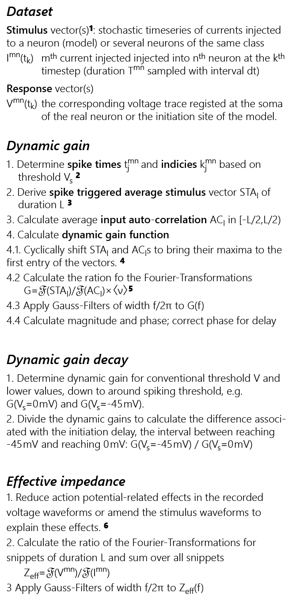

<!DOCTYPE html>
<html>
<body>

The Dynamic Gain Code requires the *ANtools_extended.ipf*  but no external functions from outside the repository. This said, loading data from *Clampex* or *PatchMaster* original files requires additional files. You can find those at [bpc_ReadAxg](https://www.wavemetrics.com/project/bpc_ReadAxg) and [bpc_ReadHeka](https://www.wavemetrics.com/project/bpc_ReadHeka), which were created by htasche.

### Requirements

Raw data have to be represented as pairs of voltage and current waves which have to be named with a common trial name and the suffixes "_V" and "_I". For automation, all trial names should start with the same prefix. The units of amplitude and time should be Volt and Ampere, and Seconds.  

All parameters, such as voltage thresholds or minimal time intervals for spike detection are expected to be in SI units (Volts, Seconds, Ampere etc.). The outcome of analyses, spike train features (e.g inter-spike intervals), action potential shape features (e.g. width, height, after-hyperpolarization magnitude), and Dynamic Gain Magnitude and Phase are also given in units that are combinations of SI units without prefactors (e.g. Hertz / Ampere for the Dynamic Gain Magnitude).

### Overview of the implemented calculations
The calculations are explained in the publications, in particular in [Merino et al. 2021 PNAS](https://doi.org/10.1073/pnas.2114549118) and [Zhang et al. 2023 BioRxiv](https://doi.org/10.1101/2022.02.04.479104). The following figure gives an overview. 

