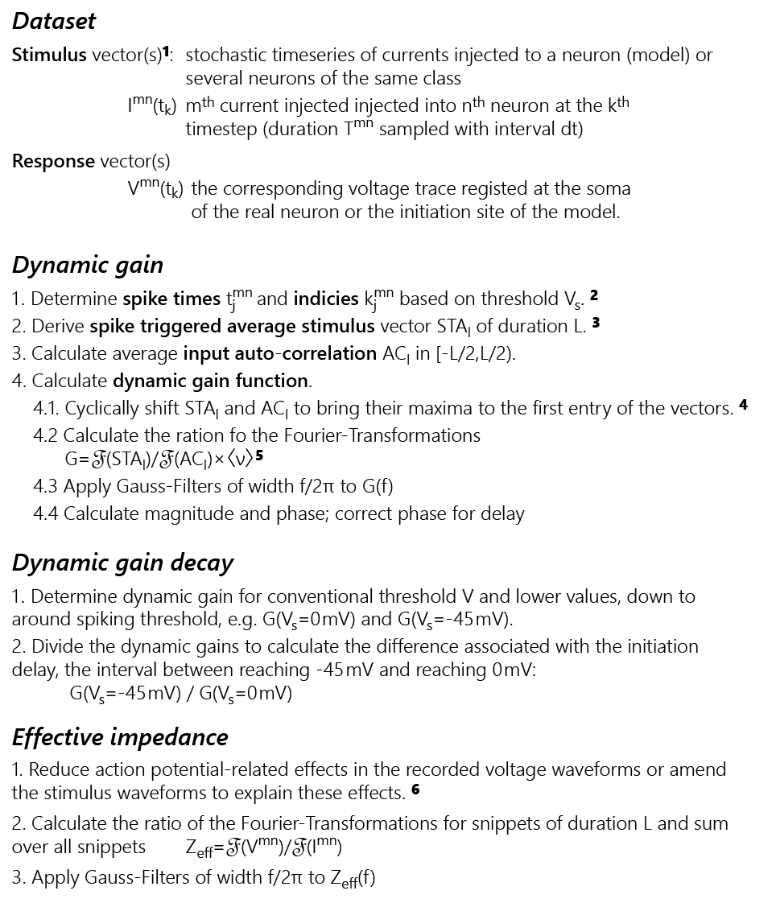
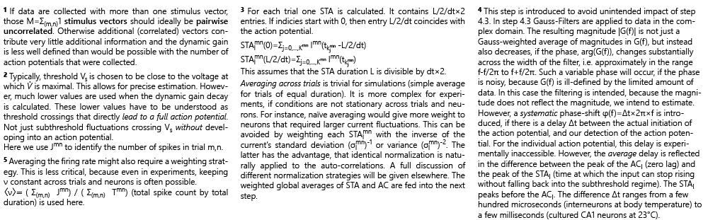

<!DOCTYPE html>
<html>
<body>
  
## Dynamic Gain
  
Through its synapses, a cortical neuron receives hundreds to thousands of inputs per second, so its membrane potential is constantly fluctuating. These fluctuations drive the cell to fire action potentials. The dynamic gain function captures the relationship between the different frequency components that constitute the input, e.g., slow undulations or more abrupt fluctuations, and the times at which action potentials are initiated. This explanation prescribes a method to measure dynamic gain: 
i) inject a random fluctuating current that drives irregular firing at a pre-decided rate,
ii) superimpose a weak sinusoidal current, and
iii) determine how strongly the action potential generation is phase-locked to the sinusoid (see [Revah et al. 2025 bioRxiv](https://www.biorxiv.org/content/10.1101/2024.02.15.580451v5) Fig. S1A to S1C).
Thus, frequencies that cause stronger phase-locking are amplified in the neuron’s output. In this sense, the dynamic gain function is essentially a tuning curve, since it captures how the neuronal output reflects the various brain rhythms and conveys them to downstream neurons. 
The dynamic gain not only exposes the neurons to brain rhythms, it also exposes how rapidly the cell can respond with an AP. Thus, a wider bandwidth of the dynamic gain function results in an earlier, stronger, and narrower response. In our study we used the dynamic gain function to reflect encoding by a neuronal population. When several neurons that contact the same downstream neuron, receive a common input, this population’s collective encoding can be captured by averaging the individual neurons’ (complex-valued) dynamic gain functions, weighted by each neuron’s firing rate. 
An alternative method to derive the dynamic gain function does not require an additional sinusoidal input (see Methods: Dynamic gain calculation and Fig. S1D to S1E) because the stochastically fluctuating input is, itself, composed of various frequency components. The results of these two approaches are not only theoretically identical [Stubenrauch and Lindner, 2024 PRX](https://doi.org/10.1103/PhysRevX.14.041047) but also identical in our experiments ([Revah et al. 2025 bioRxiv](https://www.biorxiv.org/content/10.1101/2024.02.15.580451v5) Fig. S1E). 

### Requirements
The Dynamic Gain Code requires the *ANtools_extended.ipf*  but no external functions from outside the repository. Should you wish to import data in the proprietary file formats of *Clampex* or *PatchMaster* into Igor Pro, I suggest you use the additional files created by htasche, which are available at [bpc_ReadAxg](https://www.wavemetrics.com/project/bpc_ReadAxg) and [bpc_ReadHeka](https://www.wavemetrics.com/project/bpc_ReadHeka).

Raw data have to be represented as pairs of voltage and current waves which have to be named with a common trial name and the suffixes "_V" and "_I". For automation, all trial names should start with the same prefix. The units of amplitude and time should be Volt and Ampere, and Seconds.  

All parameters, such as voltage thresholds or minimal time intervals for spike detection are expected to be in SI units (Volts, Seconds, Ampere etc.). The outcome of analyses, spike train features (e.g inter-spike intervals), action potential shape features (e.g. width, height, after-hyperpolarization magnitude), and Dynamic Gain Magnitude and Phase are also given in units that are combinations of SI units without prefactors (e.g. Hertz / Ampere for the Dynamic Gain Magnitude).

### Overview of the implemented calculations
The calculations are explained in the publications, in particular in [Merino et al. 2021 PNAS](https://doi.org/10.1073/pnas.2114549118) and [Zhang et al. 2024 J Neurosci](https://doi.org/10.1523/JNEUROSCI.0799-23.2023). The following short summary gives an overview. More details are provided in the footnotes. A comparison between two different methods are provided in the supporting material in [Revah et al. 2025 bioRxiv](https://www.biorxiv.org/content/10.1101/2024.02.15.580451v5). There, we show that the linear approach captures the response very well. We also show that the Dynamic Gain measurements based on the noise input alone (spike-triggered average current) or based on an additional sinusoidal input (vector strength) fully agree with each other. 

